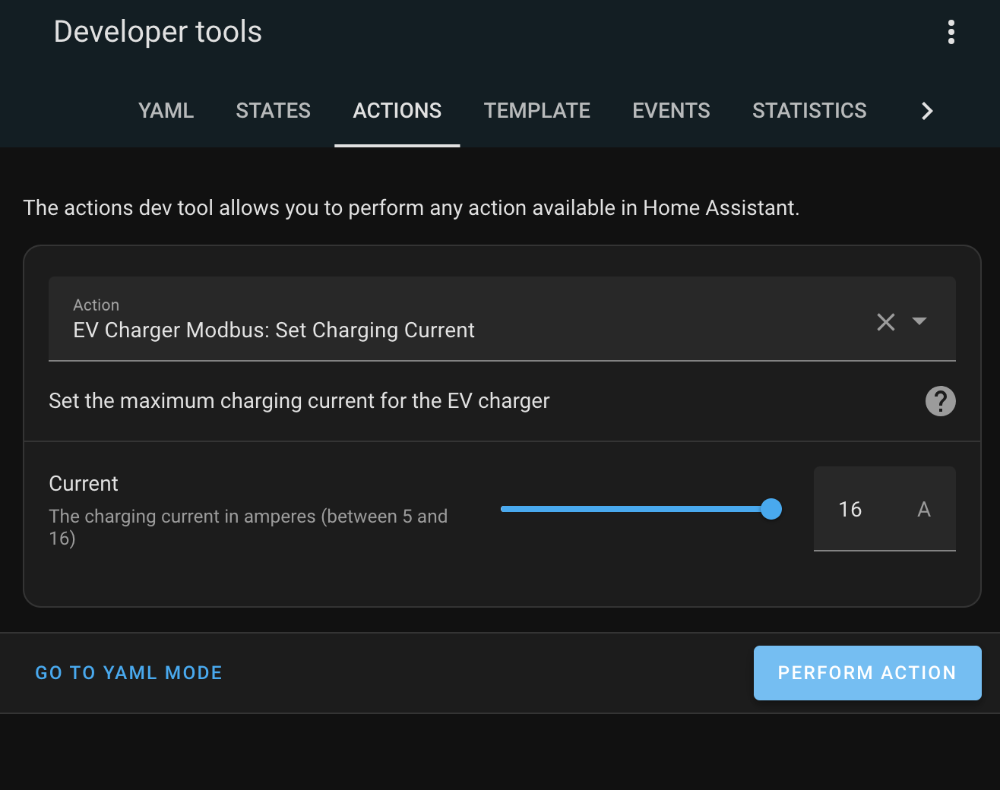

# Home Assistant AddOn for set max current on ABL EMH1 charger over RS485 MODBUS

Allows you to connect the ABL EMH1 charger over RS485 modbus connection to homeassistant and update the max charging current.

## Installation
Add the files to your /custom_components/ folder and restart home assistant
You should now be able to 

## Test:

Find the service and send the update!

