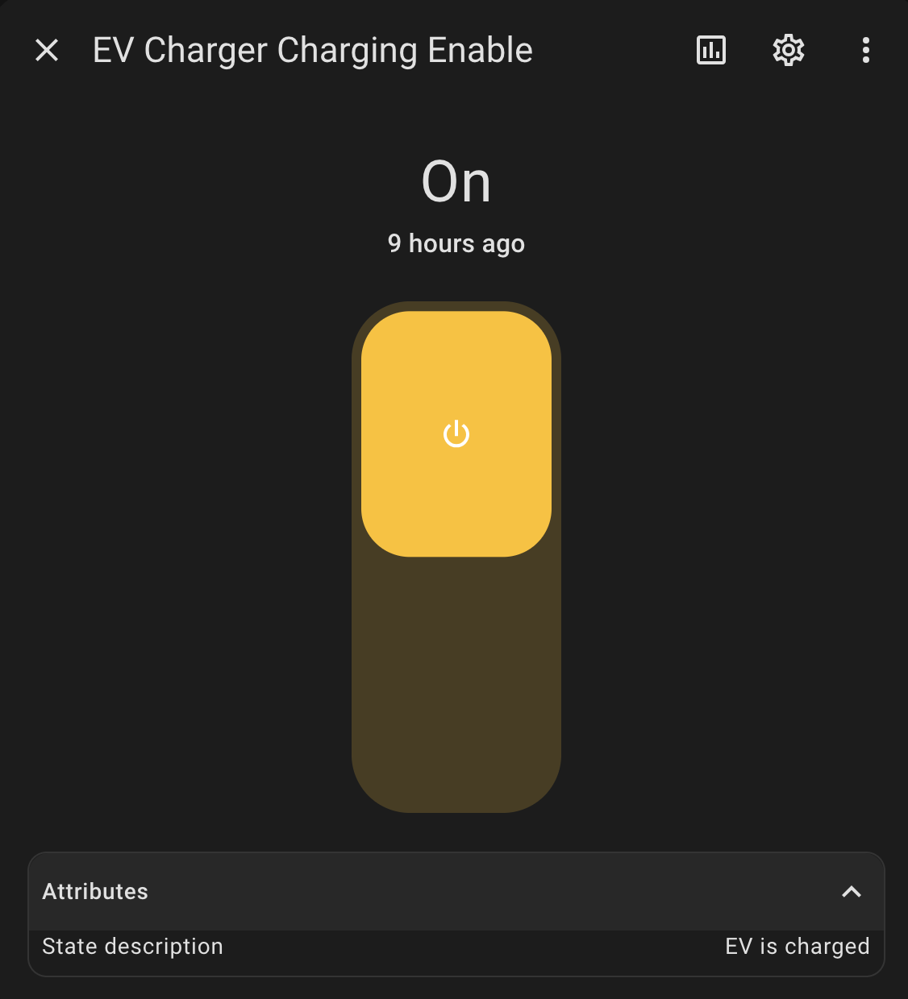

# Home Assistant AddOn for setting max current on ABL EMH1 charger over RS485 MODBUS


Allows you to connect the ABL EMH1 charger over RS485 modbus connection to homeassistant and update the max charging current.


## Installation
Add the files to your /custom_components/ folder.
```
config/
└── custom_components/
    └── ev_charger_modbus/
        ├── __init__.py
        ├── const.py
        ├── manifest.json
        ├── number.py
        ├── modbus_device.py
        └── services.yaml
needs update depending on DEV

```

Edit your configuration.yaml and include the actviation of the service and some logging:
```
ev_charger_modbus:
  port: /dev/ttyUSB0  # Adjust to your USB port
  name: EV Charger    # Optional
  slave: 1            # Optional
  baudrate: 38400     # Optional

logger:
  default: info
  logs:
    custom_components.ev_charger_modbus: debug
```

and restart home assistant.


You should now be able to 

## Test:

Find the service and send the update!
Select either 0 Amps or any value between 5 and 16


A switch has been created and can be found in the entities. This enables disabling the charger or enable the charger if it was previously disabled.
The switch scans the state of the charger to be in the right position.
Disabling the charger and setting to 0 amperes has some nuances where depending on your use case, one is better fitted.

